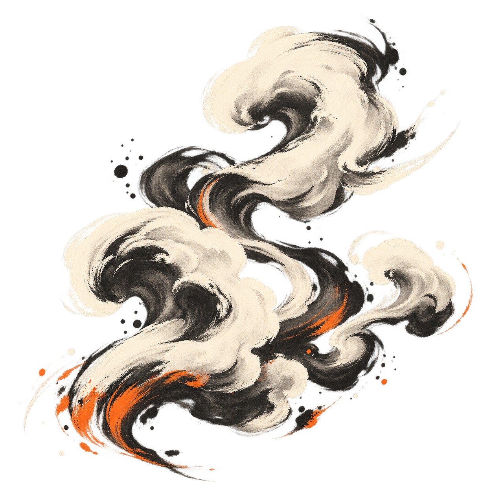
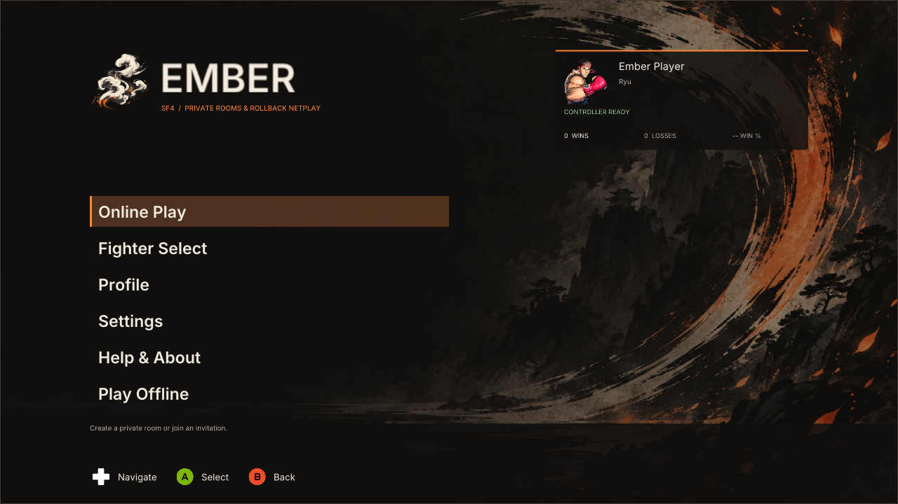
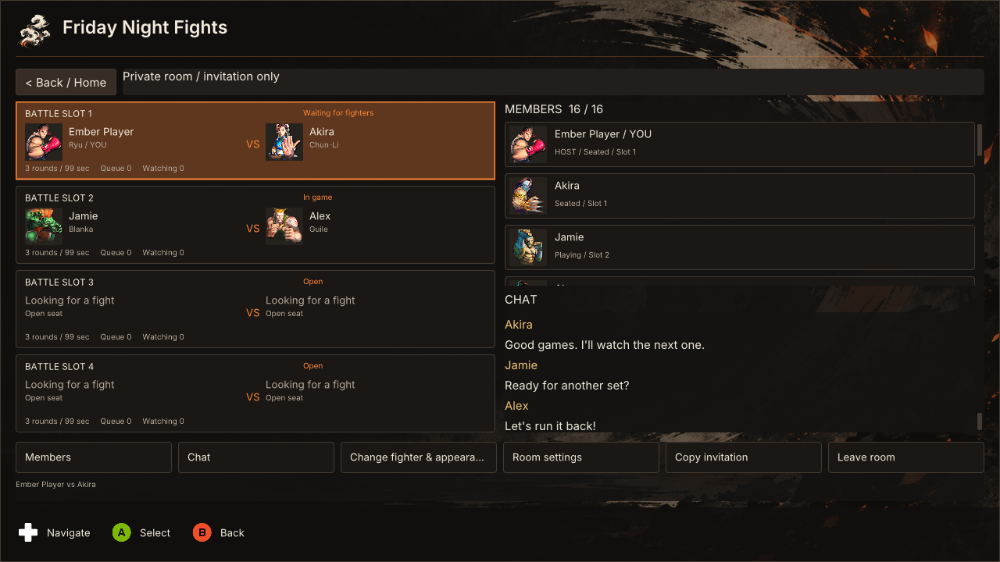
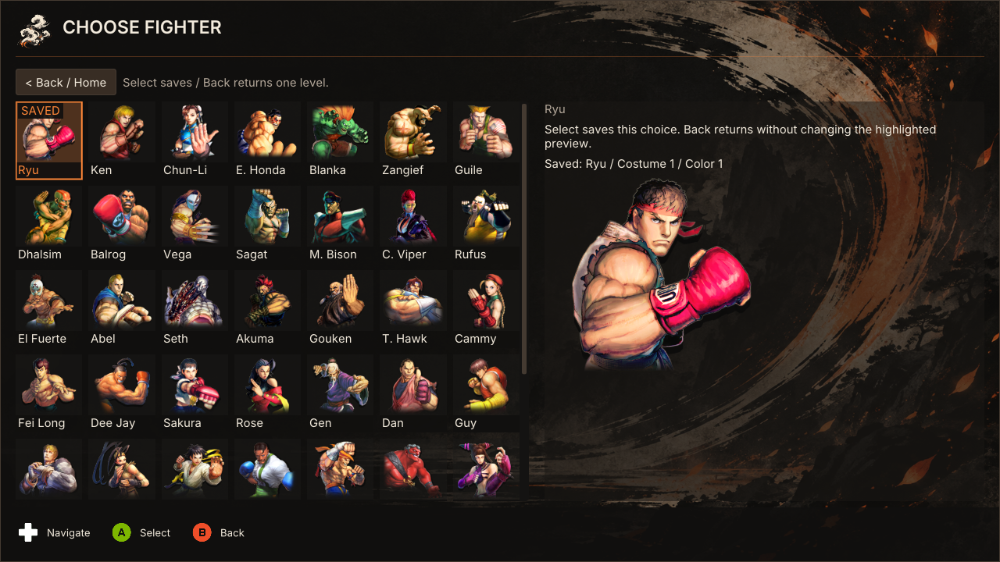
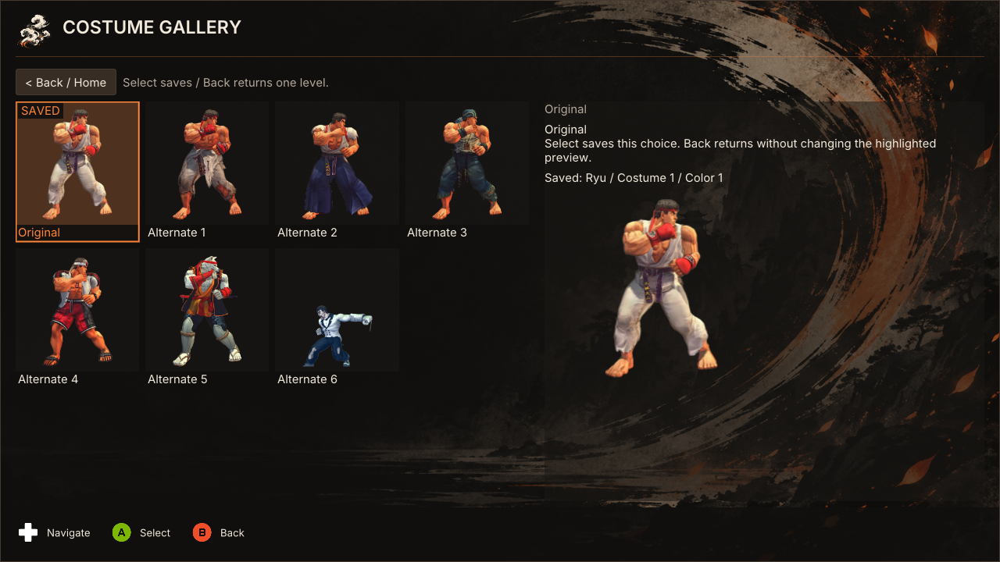
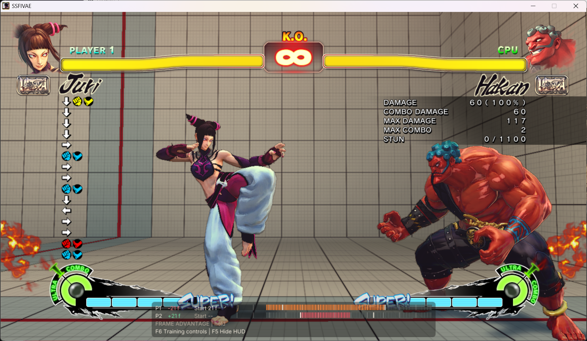

  
  <h1>SF4 Ember Netplay</h1>
  
<strong>Your room. Your rivals. One more game.</strong>

  
Private rollback rooms and a controller-first overlay for Ultra Street Fighter IV.

  

    
    
    
  

  

    <strong><a href="https://github.com/Confetti3/SF4-Ember-Netplay/releases/download/v0.9.4/sf4-ember-netplay-0.9.4.zip">Download v0.9.4 for Windows</a></strong>
    &nbsp; · &nbsp; <a href="#get-started">Get started</a>
    &nbsp; · &nbsp; <a href="docs/guides/USER_NETPLAY.md">Player guide</a>
    &nbsp; · &nbsp; <a href="docs/release-notes/RELEASE_NOTES_v0.9.4.md">Release notes</a>
  

**SF4 Ember Netplay** brings private rooms, four rollback battle tables, spectators and offline training tools into a fixed in-game interface. Create a room, share an invitation and choose where to play or watch. The charcoal, ivory and orange interface supports controllers, arcade sticks and keyboard navigation.

An **experimental unofficial port** of **[sf4e](https://codeberg.org/adanducci/sf4e)** by **Anthony Danducci and contributors**, under the MIT license. Anthony Danducci does not maintain, endorse or support this build. Ember is not affiliated with Capcom or Valve. See [attribution](ATTRIBUTION.md) and [scope and limitations](docs/guides/SCOPE_AND_LIMITATIONS.md).

## Inside Ember

| Play together | Make it yours |
| --- | --- |
| Private rooms for up to 16 members | Fighter, edition, costume, color and Ultra selection |
| Four battle tables, queues and spectators | Player profile, main fighter and confirmed online record |
| Room chat and short invitations | SF4 controller assignment, including DirectInput sticks |
| Iroh networking and Discord invitations | Controller prompts and interface settings |

### A room for the whole group

Join a table, enter its queue or watch the next game. Room membership and active matches are separate, and each member plays one game at a time.

### Choose your fighter

Save your fighter and appearance before joining a room or while waiting. Select your edition, Ultra and available costume and color; P1 chooses the stage.

### Find your look

Browse costume previews, choose an available outfit and fine-tune its color before returning to your room.

The screenshots above are fresh captures from the **actual 0.8.0 UI renderer**, using sample session data. They are not photographs of a live multiplayer test.

### Frame meter

An in-game capture supplied by the project owner, showing Ember's frame meter, player timelines and frame-advantage readout during training.

## Get started

You need **Windows 10 or later (x64)**, an owned **Steam copy of Ultra Street Fighter IV**, and the **Microsoft Visual C++ x86 runtime**. The game is not included.

1. For a fresh installation, [download the complete v0.9.4 ZIP](https://github.com/Confetti3/SF4-Ember-Netplay/releases/download/v0.9.4/sf4-ember-netplay-0.9.4.zip) and its [SHA-256 checksum](https://github.com/Confetti3/SF4-Ember-Netplay/releases/download/v0.9.4/sf4-ember-netplay-0.9.4.zip.sha256). Choose a release package, not GitHub's source-code download.
2. Extract everything into a **new writable folder**. Keep your old launcher installation separate; moving from the legacy launcher to Ember is a fresh install.
3. Run `preflight.cmd`, then `Launcher.exe`. Successful startup goes directly to the game. If needed, select the folder containing `SSFIV.exe` in launch recovery.
4. At the main menu, choose your controller and player name. Use **Online Play → Create Room**, then copy the invitation. Guests choose **Join Room** and paste it.
5. Choose a table, join its queue or watch. Save your fighter selection and ready when seated. **All participants must use the same Ember release.**

No VPS account or manual port configuration is required. Iroh can use public relays when a direct connection is unavailable. Discord support is included in the package.

### Controls

| Action | Keyboard | Assigned XInput controller | DirectInput / arcade stick |
| --- | --- | --- | --- |
| Navigate | Arrow keys | D-pad | SF4-mapped directions |
| Select | Enter | A | SF4-mapped Light Punch |
| Back | Escape | B | SF4-mapped Light Kick |
| Open at safe menu states | F10 | Start | SF4-mapped Start |

Back returns through menus and can hide Ember. Leaving a room requires the explicit **Leave room** action. Use **Play Offline** for native game menus. More detail: [controller guide](docs/guides/CONTROLLER_MENUS.md).

## Settings, updates and legacy builds

Existing Ember preferences remain under `%APPDATA%\sf4e`. Help & About provides the version, update checking, attribution and redacted diagnostic exports. Ember updates use the renamed repository and verify the downloaded ZIP's SHA-256 before installation.

**`release` is the current Ember branch.** [Legacy `main`](https://github.com/Confetti3/SF4-Ember-Netplay/tree/main) preserves the previous SF4 Netplay Launcher. Its releases and [archived README](docs/archive/README-pre-ember.md) remain available. Legacy in-place upgrades to Ember are not supported; follow the fresh-install steps above.

Browse the [branch archive](docs/archive/README.md) for all retired development branches, preserved as tagged snapshots with their original commit history.

## Status and documentation

Ember remains experimental. Local builds, automated UI and transport tests, and package verification do not establish native gameplay acceptance. Results and repeated rematches, spectators, disconnect recovery, different-network play and clean-machine behavior require recorded SF4 testing. Read the [limitations](docs/guides/SCOPE_AND_LIMITATIONS.md) before playing.

| Guide | What it covers |
| --- | --- |
| [Player guide](docs/guides/USER_NETPLAY.md) | Hosting, joining, controls and day-to-day play |
| [Custom rooms](docs/guides/CUSTOM_ROOMS.md) | Tables, queues, spectators and room behavior |
| [Discord](docs/guides/DISCORD.md) | Presence, invitations and privacy |
| [Troubleshooting](docs/guides/TROUBLESHOOTING.md) | Startup, connections and diagnostics |
| [Saving logs](docs/guides/SAVING_LOGS.md) | Save logs and diagnostics from both players for a bug report |
| [Build and package](docs/development/BUILDING.md) | Reproducible local builds and release provenance |
| [All documentation](docs/README.md) | Design notes, validation results, reports and release notes |

## License and credits

This project retains the [MIT license](LICENSE), upstream copyright and **Anthony Danducci's sf4e** attribution. [ATTRIBUTION.md](ATTRIBUTION.md) records upstream, dependency, font and artwork credits. Packages include dependency notices, Inter's OFL and Kenney's input-prompt license. Capcom game imagery is separate from the source-code license.

## External Licenses and Copyright Information

Street Fighter, Street Fighter 4, Ultra Street Fighter 4, and all related software
Copyright (c) CAPCOM.

Steam
Copyright (c) Valve Corporation.

Visual Studio, vcpkg, and Detours
Copyright (c) Microsoft Corporation.

CMake - Cross Platform Makefile Generator
Copyright (c) Kitware, Inc. and Contributors.

ValveFileVDF
Copyright (c) Matthias Moeller.

Dear Imgui
Copyright (c) Omar Cornut

spdlog
Copyright (c) 2016 Gabi Melman.

nlohmann/json
Copyright (c) 2013-2022 Niels Lohmann

GGPO (Good Game Peace Out)
Copyright (c) GroundStorm Studios, LLC.
