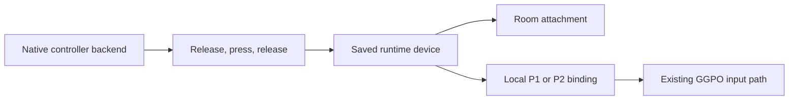

# Controller assignment, saved selection and tiny HUD

The launcher now captures an explicit gameplay device through SF4's own controller backend, uses one saved fighter selection, and draws a tiny player HUD. Hardware and two-PC acceptance remain pending.

## Scope and evidence

See [authorized implementation scope](controller-selection-scope.md). This was a local source fix with bounded, read-only native inspection, not a security assessment.

The copied Steam 1.05 x86 executable has SHA-256 `5d724595a8ab3c6c6d6f4959187f756f5be35bb497e51e5233c4e73b18b0b9eb`. Local native artifacts are under `build/controller-evidence/`. IDA worker startup timed out; the native evidence below was collected with MSVC dumpbin instead.

| Evidence | Source and reproduction | Result |
|---|---|---|
| E-1 | `build/combined/PadAssignmentTest.exe`, before replacing the old path | Failed: native keyboard assignment was reused without attempting controller capture. The original assertion was `pad.captures == 1 && type == PADTYPE_XINPUT && index == 2`. |
| E-2 | `dumpbin /imports build/controller-evidence/SSFIV.exe` -> `imports.txt` | The import view includes XInputGetState, XInputGetCapabilities and DirectInput8Create. |
| E-3 | `dumpbin /disasm /range:0x511110,0x511490 build/controller-evidence/SSFIV.exe` -> `capture.asm` | Native capture assigns type 3 to controller indices below 4 and type 4 to indices 4 and above. Both use the controller backend. Raw keyboard capture is type 1. |
| E-4 | `dumpbin /disasm /range:0x6d7290,0x6d72f0 build/controller-evidence/SSFIV.exe` | The native held-button accessor checks status 1 and returns the current button word; it does not depend on ImGui navigation. |
| E-5 | `backend-queries.asm`, `pad-status.asm`, `name.asm`, `assignment.asm` | Native backend count RVA 0x2d9120, status RVA 0x2d7080, name RVA 0x2d70b0, held buttons RVA 0x2d7290. The existing native side-binding methods preserve device index and type. |

E-2 through E-5 share the executable content hash above; generated test/log hashes are not identity claims for the game process.

## Findings and call flow

- F-1 (n/a_re, E-1, confirmed at the adapter): the previous room attachment could retain keyboard regardless of the desired controller. The new assignment state is authoritative across room attachment and both local match slots.
- F-2 (n/a_re, E-3/E-5, high-confidence static evidence): native DirectInput controllers are type 4. The old helper only recognized types 1 and 3. Type 4 now stays intact through assignment and device-release handling.
- F-3 (n/a_re, E-4/E-5, high-confidence static evidence): SF4's controller backend supports sampling and connectivity for XInput and DirectInput through the same methods. No XInput-only polling API is introduced.

P-1 (callflow): native device sample -> release-all / press / release-selected capture -> authoritative runtime assignment -> room device configuration -> native local P1 or P2 binding -> existing GGPO input capture/playback.

Keyboard is an explicit alternative. A missing device never becomes keyboard automatically. Captured input must be released, and menu navigation is paused during assignment. Closing the menu cancels capture. Devices are revalidated after restart; transient native indices are not persisted as permanent hardware identities.

The player HUD draws no ImGui window. Font size is 11 px at 1080p, clamped to 9–14 px, independently of menu scale. Both names are frozen from the authenticated match's projected P1/P2 roster at GGPO startup, including spectator startup. Rollback telemetry counts successful replay callbacks per state restore; the recent maximum expires after one second and resets on session start/retirement. Diagnostics need not be enabled.

Fighter Select owns the persisted lobby pick and stage. It uses native availability and the seated table's rules. Ready/rematch use those existing values and protocol messages. Editing no longer requires a second occupant. Ready/starting matches remain locked, and P1 stage authority is unchanged.

## Validation timeline

1. Reproduced stale keyboard reuse in the original native-adapter test.
2. Verified native type 4 and shared backend through disassembly of the copied executable.
3. Added controller state/adapter regression coverage and rollback measurement tests; both passed.
4. Rendered the changed UI at nine viewport/DPI configurations; initial pass: 2,619 frames. Final Release results and package receipt follow below.

## Native acceptance still required

On both PCs, use the same staged package. Enter the native menu with keyboard, then assign the actual controller. Verify movement and attacks in both P1/P2 roles and after a rematch. Test at least one native DirectInput stick/leverless device as well as XInput; the automated fixtures do not establish physical-device compatibility. Verify cancel, held-button release, disconnection before Ready, reconnection, saved fighter/appearance/Ultra and P1 stage. Check that the bottom line remains unobtrusive during actual play and updates under real rollback.

## Final Release and package receipt

- Full Release x86 build passed (`build/release-build.log`); the final native ownership-handoff correction also rebuilt successfully (`build/final-build.log`).
- Full CTest suite: **32/32 passed**, 202.91 seconds (`build/release-ctest.log`).
- After the final handoff correction: **5/5 focused checks passed**, 3.60 seconds: PadAssignment, RuntimeBootstrap, SessionController, SessionClientTransport, RollbackHud (`build/final-focused-ctest.log`). The adapter test now also checks release of the prior side/device reservation when moving to P2.
- Final UI render: **2,754 DX9 frames**, nine viewport/DPI configurations including 720p, 1080p and 4K, long UTF-8 names, controller actions, Ready/rematch selection values and device resets (`build/controller-hud-ui.log`). Screenshots are in `build/controller-hud-ui/`; player HUD, controller capture and 720p Ready footer were inspected visually. HUD vertex checks enforce bottom placement and the 60% width bound.
- Package preflight and native updater inventory validation passed; all **2055 manifest files** match both the folder and ZIP. ZIP CRC validation passed. All four product binaries match their build outputs; Launcher, Sidecar and Updater are x86 and sf4-net is x64.
- Local ZIP: `dist/sf4-netplay-launcher-controls-selection-20260908-local.zip` (382,257,109 bytes).
- ZIP SHA-256: `3314bc8172f9fc7e7dc256f3fb91bddca3bc7818548b9ff6b2eb567465e19b4d`.
- `git diff --check` passed. No game was installed or launched, and no changes were published. The separate training worktree was not edited.

The original package above is superseded by the refreshed package below. Physical controllers and two-PC gameplay have not been retested in this run.

## Shorter invitation follow-up and refreshed package

The user clarified that the actual invitation text should be shorter. `sf4e2:` invitations use a compact binary payload with fixed relay IDs instead of Base64 JSON. A production build's 64-character SHA-256 build identity produces a **213-character invitation**, less than half the previous format in the regression fixtures. Endpoint identity, the complete 256-bit capability, room ID, expiry, protocol version and build ID are retained. Relay IDs have an explicit stable dictionary, independent of map iteration order. The parser still accepts valid `sf4e1:` invitations; older helpers cannot read the new format. Both PCs should use this package. Ready and transport messages are unchanged.

- Release build passed: `build/short-invites-release-build.log`.
- Rust formatting and Clippy with warnings denied passed. The initial Clippy invocation lacked the Windows SDK resource compiler; rerunning from the Visual Studio developer environment passed (`build/short-invites-clippy.log`).
- **22/22 Rust unit tests passed**, including compact/legacy admission, every supported relay, exact length, malformed/truncated input, invalid relay, expiry, zero capabilities/room IDs and maximum build length (`build/short-invites-rust-test.log`). Two optional public-network Rust integration tests remain ignored by the default command; the CTest relay tests below were run.
- **32/32 CTest checks passed**, 173.85 seconds, against the rebuilt helper. This includes UI, input, selection, session startup, multiple tables, spectators, direct and relay host/join/match tests (`build/short-invites-ctest.log`).
- Additionally inspected the saved 720p/200% and 4K/150% HUD renders; the text stays at the bottom independently of menu scaling. These are synthetic render fixtures, not gameplay screenshots.
- Package preflight, native updater inventory, all **2055 manifest entries** in both the folder and ZIP, ZIP CRC, and all four product binary comparisons passed (`build/short-invites-package-receipt.json`).
- Current local ZIP: `dist/sf4-netplay-launcher-controls-selection-short-invites-20260908-local.zip` (382,315,324 bytes).
- ZIP SHA-256: `a0f150a3325bd2642c50a130cf2b4333cc742654d04da8b93de1734e7c8d1176`.

The package is staged locally for the native acceptance steps above. No game was installed or launched and nothing was published.
