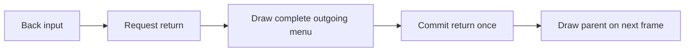

# Costume, menu and long-session training repairs

These changes restore owned DLC choices, keep navigation frames complete, and
prevent long training sessions from losing the frame-advantage measurement.
Automated regression evidence is available; live acceptance of the new package
is still required. The running game was neither replaced nor restarted.

## Native costume evidence

Target: Steam USFIV 1.05, executable SHA-256
`5d724595a8ab3c6c6d6f4959187f756f5be35bb497e51e5233c4e73b18b0b9eb`.
The running recovery candidate matched the designated staged Sidecar before
these changes. A read-only capture of its costume manager showed:

| Fighter | Native flags | Old gallery mask | Ownership mask |
| --- | --- | --- | --- |
| Ryu (0) | `0x000f007f` | `0x0f` (four choices) | `0x7f` (seven choices) |
| Decapre (43) | `0x0003003f` | `0x03` (two choices) | `0x3f` (six choices) |

Native `69FBD0 -> 69FFD0` checks the low ownership byte. Callers `684750` and
`6A0820` use it to validate or reset costume selections. Ember previously used
the high menu mask (`69FBB0 -> 69FF90`), which excluded the later owned outfits.
The repair reads ownership without writing native flags. Catalog bounds still
exclude reserved slots; unowned costumes stay unavailable. Artwork does not
control eligibility. Color and personal-action unlock rules are unchanged.

Local evidence is under `build/costume-menu-fix`: `live-costume-flags.json`,
the read-only capture script, and the three native caller decompilations. This
is a single running-session capture, not an observed before/after game test.

## Menu and training causes

Back previously returned before the menu body was drawn. Controller/keyboard
Back could omit the entire menu; mouse Back could leave only the header.
Navigation now commits the return after rendering, including training flyouts.
Queue updates continue using the existing room actions and protocol.

The subsequent live report isolated another symptom: room-control refreshes
moved/flashed controls on the same page. A healthy-to-recovering update inserted
a disabled status row above Queue, and the variable-height header could move
the whole controls pane when its message wrapped. `RoomPanelNavigation` failed
with `Room-control refresh moved the queue control and flickered the menu layout`.
Room feedback now occupies a fixed area alongside Back on wide windows or two
lines below it on narrow windows, and recovery text
does not participate in the selectable row list. Replacement, when offered,
is appended after existing actions. Recovery still disables mutations
immediately; no backend health or authority gates were relaxed.

The refresh regression alternates control health for 60 frames on the overview
and table pages at 1280x960 and 640x720, with 100% and 150% UI scale. It checks
pane position/size, Queue position, focus, page identity, visible recovery reason,
and action eligibility. Background updates must never dispatch an action.

The native simulation counter's signed 16-bit integral becomes negative at
32,768 frames (about 9 minutes of active simulation at 60 fps). Training used
those negative timestamps as the sentinel for unrecovered fighters. The meter
now checks native continuity modulo 16 bits and uses a separate 64-bit elapsed
clock for recovery. Gaps still reset the measurement; ordinary counter wrap
does not. No simulation or gameplay timing is changed.

## Regression checks and acceptance

The new tests failed before their fixes with `Owned Ryu DLC costumes disappeared
from selectable choices`, `Back left a blank room-menu transition frame`, and
`Native signed-frame rollover stopped training advantage`.

- `NativeSelectionAvailability`: captured flags, original/later rosters, sparse
  ownership, reserved slots, missing art, and saved DLC choices across lock/unlock.
- `RoomPanelNavigation`: menu body and draw geometry on every transition frame;
  queue entry/exit, promotion, rules submenus and Back; one action per activation.
- `ControllerNavigation`: shared menus, training flyout, input and selection paths.
- `TrainingSession`: both native counter boundaries and 131,100 observations with
  repeated exchanges, alongside existing hitstop, cancel, reset and gap checks.

The first full run passed 33/34 checks; `DiscordBridge` failed because its
singleton test competed with the running production launcher. The test now
uses a per-process mutex scope, still checking real contention and release.
Production callers retain the original default mutex name and security rules.

Run `scripts/build-current.ps1` for the designated build and offline checks.
Package with `scripts/package-team.ps1` using `build/current` and
`build/current/stage`; the package retains its source fingerprint and hashes.
Live acceptance must verify DLC appearance in a match, the reported room
navigation sequence, and advantage after a training session passes both
counter boundaries without reloading.
