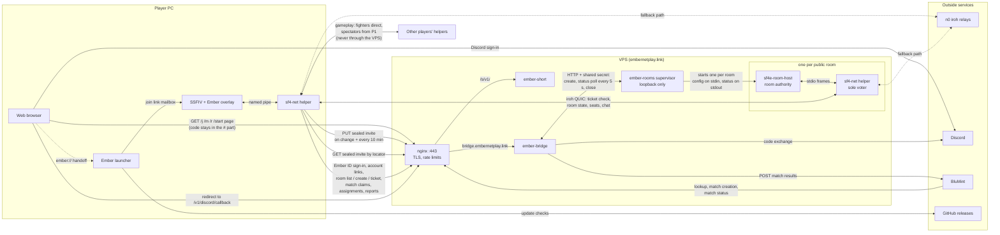
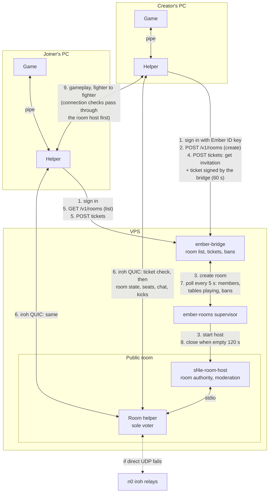
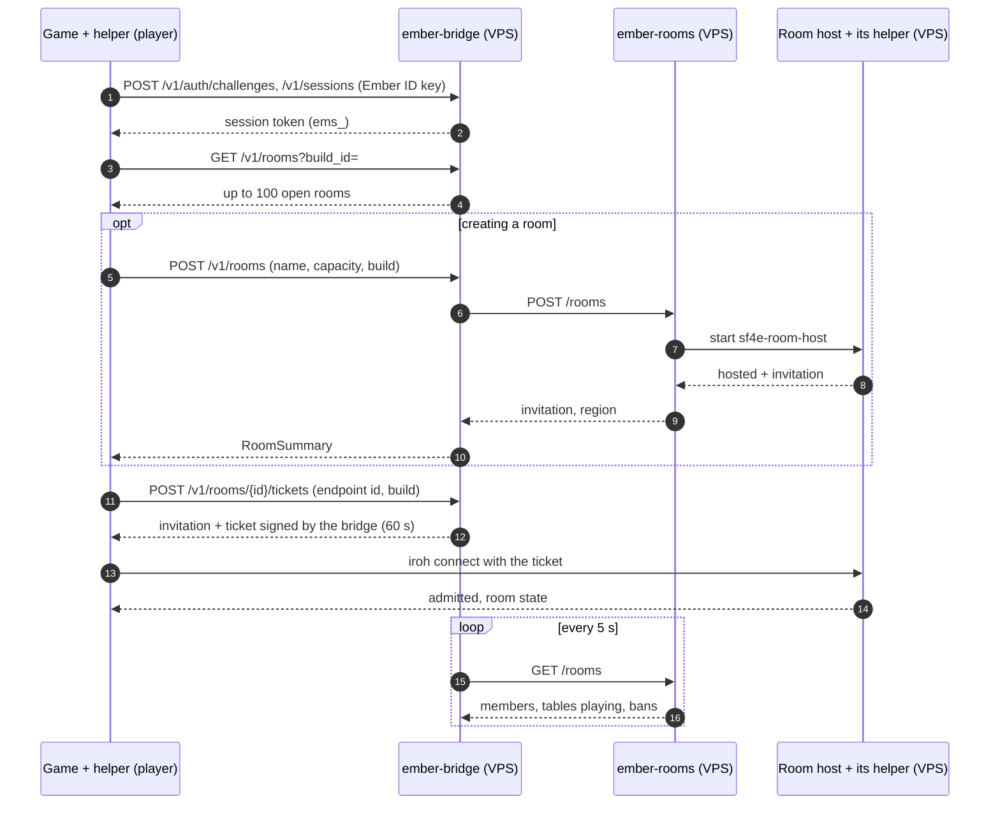
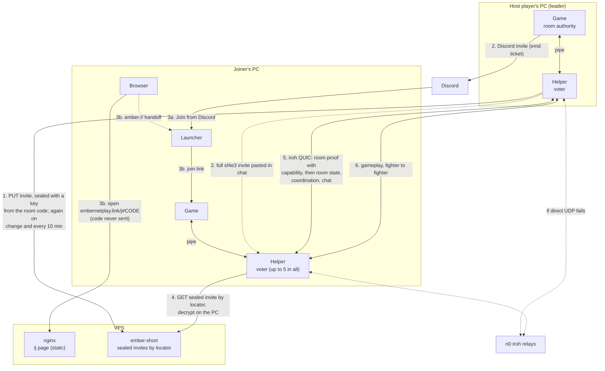

# Server

Everything that runs on the Ember VPS, rather than on players' machines.
All of it runs on Linux, built in WSL (Ubuntu) and copied up; the VPS itself
has too little memory to build.

| Folder | What runs | Deploy |
|---|---|---|
| [ember/bridge](ember/bridge) | `ember-bridge`: Ember ID, tournaments, partner API, public room list and tickets | [ember/bridge/deploy](ember/bridge/deploy) |
| [ember/notifier](ember/notifier) | room bot and event poster for Discord and Twitch | see [INTEGRATIONS.md](../docs/guides/INTEGRATIONS.md#discord-and-twitch) |
| [ember-rooms](ember-rooms) | `ember-rooms`: the public room supervisor; starts one room host per room | [ember-rooms/deploy](ember-rooms/deploy) |
| [roomhost](roomhost) | `sf4e-room-host`: one public room (C++, shares the session code in `src/`) | built with [roomhost/build-linux.sh](roomhost/build-linux.sh), installed by ember-rooms |
| [ember-short](ember-short) | `ember-short`: short invitation links and the embernetplay.link pages | [ember-short/deploy](ember-short/deploy) |
| [ember-reports](ember-reports) | `ember-reports`: opt-in crash/problem reports and local symbolication, forwarded to Bugsink | [ember-reports/deploy](ember-reports/deploy) |

Shared with the game:

- [ember/protocol](ember/protocol) is also compiled into the player's network
  helper (`rust/sf4-net`), so a change there changes the client too.
- Each public room runs the game's own `sf4-net` helper next to the room host,
  and both must come from the same commit as the client release they serve.

More:

- [Hosting public rooms](../docs/development/PUBLIC_ROOM_HOSTING.md): what a
  room costs, server sizes and hosting options.
- [Public rooms design](../docs/design/PUBLIC_ROOMS.md) and
  [integration paths](../docs/design/INTEGRATION_PATHS.md).
- [Integrating with Ember](../docs/guides/INTEGRATIONS.md): running a local
  bridge, the partner API and the room bot.

## What travels between the VPS and players

Coordination and optional diagnostic reports reach the VPS. Match inputs go
player to player, directly or through the n0 iroh relays, so the VPS never
carries gameplay. Updates come
from GitHub releases, not the VPS. The Discord and Twitch room bot is left out.

### Public rooms

The VPS owns the room. A room host on the VPS is the authority and the only
coordination voter; players need an Ember ID and a ticket from the bridge.

The bridge also answers `GET /v1/rooms/public` with no credential: the same
rooms and details a player's detailed list shows, plus the bridge ID. The
embernetplay.link/rooms page reads it as `/rooms.json` (nginx caches it for
5 s) and joins through `ember://room/open` links. At each release, add the new
Sidecar build ID to `VERSIONS` in `ember-short/deploy/site/assets/rooms.js`;
rooms on a build missing there show "Other version".

Step by step for one player joining:

- If the room host stops, the room is closed; there is no new leader.
- A kick bans the Ember ID for the room's life (at most 512 per room).
- Players never learn each other's addresses through the room; only fighters
  in a match connect to each other.

### Private rooms

The host player's game owns the room. The VPS is only a mailbox for the short
link, and only when someone uses one. Pasted `sf4e3:` invites and Discord
invites never touch the VPS.

- If the leader leaves, the remaining voters elect a new leader, and the new
  leader keeps the short link updated, so the same link still works.
- A kick lasts until the host's helper restarts.
- Tournament match rooms are private rooms with one extra call: the helper
  tells the bridge where the room is (`POST /v1/matches/{id}/room`) so the
  opponent can find it.
